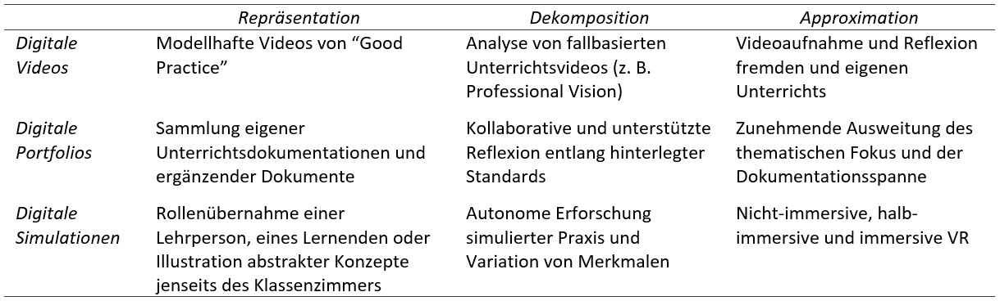

<style>
slides > slide:not(.nobackground):after {
  content: '';
}
</style>


```{r setup, include=FALSE}
knitr::opts_chunk$set(echo = FALSE,
                      message=FALSE, 
                      warning=FALSE)
# download.file("https://drive.google.com/uc?export=download&id=1NOgadyAeqmtqJ2mLI0GZHmOkavS5LLeW",
#               "www/references.bib", overwrite = T)
library(fontawesome)
```


## Punkte aus der Ausschreibung

1. "eigenständige Forschung mit Videodaten"<br /><br /><br />
2. "Weiterentwicklung der Methodik"<br /><br /><br />
3. "Infrastruktur für Nachnutzung und Analyse unterrichtsbezogener Videodaten"


# Unterrichtsvideos

## Theoretische Einordnung

Nutzung von Video zur Erforschung...

<div class="container">

 <div class="box30" style="background-color:#ececec; padding: 18px 5px 5px 5px;">von Unterrichtspraxis<br />_(Video als Datenquelle)_</div>
 <div style="width:5%; text-align: center; padding-top:35px"></div>
 <div class="box30" style="background-color:#ececec; padding: 5px;">der Entwicklung<br />von Professionalität<br />_(Video als Lernressource)_</div>
 
</div>
 

## Theoretische Einordnung

Nutzung von Video zur Erforschung...

<div class="container">

 <div class="box30" style="background-color:#ececec; padding: 18px 5px 5px 5px;">von Unterrichtspraxis<br />_(Video als Datenquelle)_</div>
 <div style="width:5%; text-align: center; padding-top:35px">`r fa(name = "arrow-right", fill="grey")`<br />`r fa(name = "arrow-left", fill="grey")`</div>
 <div class="box30" style="background-color:#ececec; padding: 5px;">der Entwicklung<br />von Professionalität<br />_(Video als Lernressource)_</div>
 
</div>


## Theoretische Einordnung

Nutzung von Video zur Erforschung...

<div class="container">

 <div class="box30" style="background-color:#ececec; padding: 18px 5px 5px 5px;">von Unterrichtspraxis<br />_(Video als Datenquelle)_</div>
 <div style="width:5%; text-align: center; padding-top:35px">`r fa(name = "arrow-right", fill="grey")`<br />`r fa(name = "arrow-left", fill="grey")`</div>
 <div class="box30" style="background-color:#ececec; padding: 5px;">der Entwicklung<br />von Professionalität<br />_(Video als Lernressource)_</div>
 
</div>
 
\
\


* Reflexion über Unterrichtsfälle als Chance der Entwicklung von Professionalität<span class="mysource">[@schneideretal.2020]</span><br /><br />
* über prominente Professionalisierungstheorien hinweg<span class="mysource">[@terhart.2000; @helsper.2004; @baumertetal.2006]</span>


## Unterrichtsvideos | für die professionelle Entwicklung von Lehrpersonen (1)

__[@kleinknechtetal.2013]__  

`r fa(name = "users", fill="grey")` Lehrpersonen<br /><br />
`r fa(name = "bullseye", fill="grey")`  Vergleich schriftlicher Analysen bzgl. __eigener__ vs. __fremder__ Videos<br /><br />
`r fa(name = "eye", fill="grey")`  Analyse von Unterricht, emotionale und motivationale Äußerungen

  
  
## Unterrichtsvideos | für die professionelle Entwicklung von Lehrpersonen (1)

__[@kleinknechtetal.2013]__  

`r fa(name = "users", fill="grey")` Lehrpersonen<br /><br />
`r fa(name = "bullseye", fill="grey")`  Vergleich schriftlicher Analysen bzgl. __eigener__ vs. __fremder__ Videos<br /><br />
`r fa(name = "eye", fill="grey")`  Analyse von Unterricht, emotionale und motivationale Äußerungen

{width=100%}


## Unterrichtsvideos | für die professionelle Entwicklung von Lehrpersonen (2)

__[@schneider.2016; @schneideretal.2016; @schneideretal.2021d]__

`r fa(name = "users", fill="grey")` Lehramtsstudierende<br /><br />
`r fa(name = "bullseye", fill="grey")` Vergleich __Video-__ vs. __Textfälle__, __direkte__ Instruktion vs. __problemorientiertes__ Lernen<br /><br />
`r fa(name = "eye", fill="grey")` Analyse von Unterricht


## Unterrichtsvideos | für die professionelle Entwicklung von Lehrpersonen (2)

__[@schneider.2016; @schneideretal.2016; @schneideretal.2021d]__

`r fa(name = "users", fill="grey")` Lehramtsstudierende<br /><br />
`r fa(name = "bullseye", fill="grey")` Vergleich __Video-__ vs. __Textfälle__, __direkte__ Instruktion vs. __problemorientiertes__ Lernen<br /><br />
`r fa(name = "eye", fill="grey")` Analyse von Unterricht

{width=60%}


## Unterrichtsvideos | für die professionelle Entwicklung von Lehrpersonen (3)

__[@schneideretal.2021e]__

* Core Practices als pragmatistische Perspektive auf Professionalität<br /><br />
* Professionalisierungprozesse (Repräsentation, Dekomposition, Approximation)<br /><br />
* These: digitale Ressourcen ermöglichen Professionalisierung in besonderem Maße<br /><br />


## Unterrichtsvideos | für die professionelle Entwicklung von Lehrpersonen (3)

__[@schneideretal.2021e]__

* Core Practices als pragmatistische Perspektive auf Professionalität<br /><br />
* Professionalisierungprozesse (Repräsentation, Dekomposition, Approximation)<br /><br />
* These: digitale Ressourcen ermöglichen Professionalisierung in besonderem Maße<br /><br />


{width=85%}


## Unterrichtsvideos | im Hinblick auf das Themengebiet der Stelle


Nutzung von Video zur Erforschung...

<div class="container">

 <div class="box30" style="background-color:#ececec; padding: 18px 5px 5px 5px;">von Unterrichtspraxis<br />_(Video als Datenquelle)_</div>
 <div style="width:5%; text-align: center; padding-top:35px">`r fa(name = "arrow-right", fill="grey")`<br />`r fa(name = "arrow-left", fill="red")`</div>
 <div class="box30" style="background-color:#ececec; padding: 5px;">der Entwicklung<br />von Professionalität<br />_(Video als Lernressource)_</div>
 
</div>


## Unterrichtsvideos | im Hinblick auf das Themengebiet der Stelle


Nutzung von Video zur Erforschung...

<div class="container">

 <div class="box30" style="background-color:#ececec; padding: 18px 5px 5px 5px;">von Unterrichtspraxis<br />_(Video als Datenquelle)_</div>
 <div style="width:5%; text-align: center; padding-top:35px">`r fa(name = "arrow-right", fill="grey")`<br />`r fa(name = "arrow-left", fill="red")`</div>
 <div class="box30" style="background-color:#ececec; padding: 5px;">der Entwicklung<br />von Professionalität<br />_(Video als Lernressource)_</div>
 
</div>

\

__Einblicke und breite Erfahrung, ...__ 

1. welche Aspekte von Unterricht sich überhaupt _beobachten_ und _beforschen_ lassen
2. welche _Kontextinformationen_ zur Erkenntnisgenese aus Videodaten benötigt werden
3. wie Unterrichtsvideos _entstehen_, was sie _erfassen_ und was sie _nicht erfassen_


# Vielen Dank

{width=20%}  
\

__Jürgen Schneider__  
juergen.schneider@uni-tuebingen.de  

# Forschungsmethodik

## Forschungsmethodik | Crowdsourced Data Analysis

__[@breznauetal.2021; @breznauetal.2021a]__

`r fa(name = "eye", fill="grey")` Crowdsourced (computational) Replication und Extension<br />&nbsp;&nbsp;&nbsp;&nbsp;&nbsp;&nbsp;von Brady und Finnigan (2014)<br /><br />
`r fa(name = "bullseye", fill="grey")` Computational Replication der Ergebnisse<br /><br />
`r fa(name = "bullseye", fill="grey")` Eigene Auswertung derselben Hypothese


## Forschungsmethodik | Crowdsourced Data Analysis

__[@breznauetal.2021; @breznauetal.2021a]__

`r fa(name = "eye", fill="grey")` Crowdsourced (computational) Replication und Extension<br />&nbsp;&nbsp;&nbsp;&nbsp;&nbsp;&nbsp;von Brady und Finnigan (2014)<br /><br />
`r fa(name = "bullseye", fill="grey")` Computational Replication der Ergebnisse<br /><br />
`r fa(name = "bullseye", fill="grey")` Eigene Auswertung derselben Hypothese

<div style="position: absolute; top: 5%; left: 65%; width:35%">
 {width=100%}
</div>


## Forschungsmethodik | Crowdsourced Data Analysis

__[@breznauetal.2021; @breznauetal.2021a]__

`r fa(name = "eye", fill="grey")` Crowdsourced (computational) Replication und Extension<br />&nbsp;&nbsp;&nbsp;&nbsp;&nbsp;&nbsp;von Brady und Finnigan (2014)<br /><br />
`r fa(name = "bullseye", fill="grey")` Computational Replication der Ergebnisse<br /><br />
`r fa(name = "bullseye", fill="grey")` Eigene Auswertung derselben Hypothese

<div style="position: absolute; top: 42%; left: 45%; width:55%">
{width=100%}
</div>

## Forschungsmethodik | Standards

__[@schneideretal.2022]__

`r fa(name = "eye", fill="grey")` Präregistrierung von Metaanalysen & Systematischen Reviews<br /><br />
`r fa(name = "bullseye", fill="grey")` "make it easy": Datenanalysen, Multimedia, Multi-File, ...<br /><br />
`r fa(name = "hand-point-right", fill="grey")` RMarkdown Package _{preregRS}_

\

[Link zum Beispiel](https://raw.githack.com/j-5chneider/preregRS-jupyter/main/preregRS_example.html)


## Forschungsmethodik | Standards

__[@schneideretal.2022]__

`r fa(name = "eye", fill="grey")` Präregistrierung von Metaanalysen & Systematischen Reviews<br /><br />
`r fa(name = "bullseye", fill="grey")` "make it easy": Datenanalysen, Multimedia, Multi-File, ...<br /><br />
`r fa(name = "hand-point-right", fill="grey")` RMarkdown Package _{preregRS}_

\

[Link zum Beispiel](https://raw.githack.com/j-5chneider/preregRS-jupyter/main/preregRS_example.html)

<div style="position: absolute; top: 40%; left: 38%; width:60%">
 {width=100%}
</div>

# Open Science

## Open Science

__[@schneideretal.2021f]__:  
Einfluss von _Open Science Badges_ auf _Vertrauen_ in Wissenschaftler*innen

\

__[@schneider.2022]__:  
_Anwendbarkeit_ von Open Science Praktiken in unterschiedlichen Disziplinen & Forschungsparadigmen

\

__[@lasseretal.2022]__:  
_Mapping Review_ der Literatur zu Open Science


# {-}


<div id="refs"></div>


# &nbsp;
__Credit:__  

<span style="font-size:.7em;">
Icons by Font Awesome CC BY 4.0  
Title page photo by <a href="https://unsplash.com/@taypaigey?utm_source=unsplash&utm_medium=referral&utm_content=creditCopyText">Taylor Wilcox</a> on <a href="https://unsplash.com/?utm_source=unsplash&utm_medium=referral&utm_content=creditCopyText">Unsplash</a>
</span>